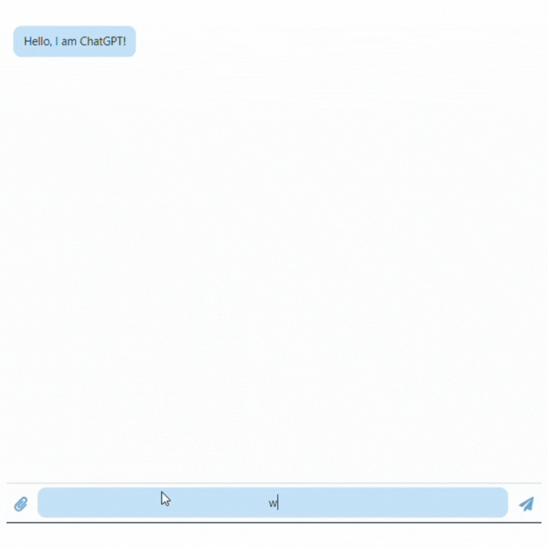

# Code_Alpha_ChatGPT_Integration
Code Alpha Internship

## ChatGPT Intergration App Preview

Copyright: OpenReplay

# Requirements
As a React + Vite app, be sure that you have these:
- Vite: installed at the root if not installed
    -  use <code>npm create vite@latest app -- --template react</code>
- React: installed in the app directory
    -  use <code>cd app && npm install && npm install @chatscope/chat-ui-kit-react</code>

<strong>N. B.:</strong> To follow along coding without any problems, create your own branch, a different
branch, and only pay attention to the <code>App.js</code> & <code>App.css</code> files
in the <code>main branch</code> in my branch

Much appreciation to:
- OpenReplay (https://blog.openreplay.com)
- OpenAI (https://chat.openai.com)
